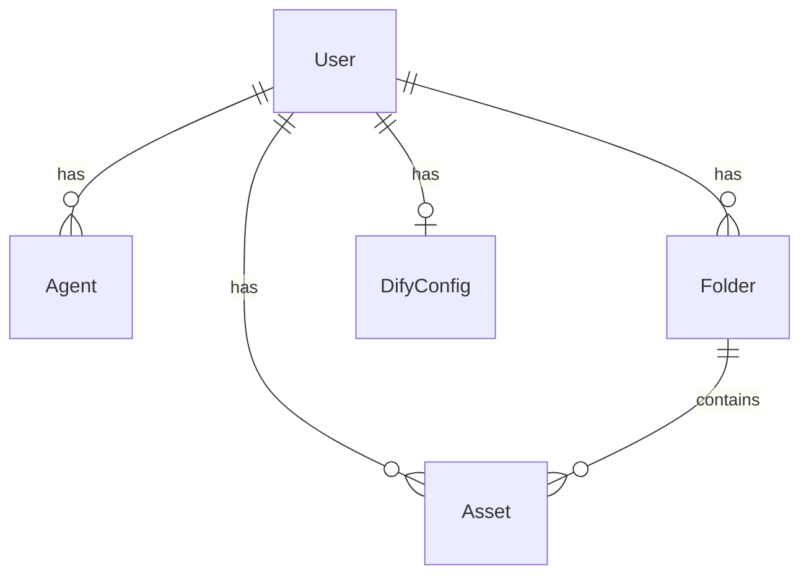

# DifyFlow 技术文档

## 1. 系统架构

DifyFlow 采用前后端分离的 Monorepo 架构：

```
difyflow/
├── packages/server/    # Express 后端
├── packages/client/    # React 前端
└── docker-compose.yml  # PostgreSQL 容器
```

## 2. 数据库设计

### 2.1 核心表结构

| 表名 | 说明 | 关键字段 |
|------|------|----------|
| `users` | 用户表 | username, email, password_hash, role |
| `agents` | 智能体表 | name, mode, app_id, api_key_encrypted |
| `folders` | 文件夹表 | name, is_default, user_id |
| `assets` | 资产表 | filename, file_type, status, parsed_text |
| `dify_configs` | Dify配置表 | dify_url, connection_status |

### 2.2 关系图



## 3. API 设计规范

### 3.1 认证

所有 API 请求（除 `/auth/login`）需携带 JWT Token：

```
Authorization: Bearer <token>
```

### 3.2 响应格式

成功响应：
```json
{
  "data": { ... }
}
```

错误响应：
```json
{
  "error": "Error message",
  "details": "Detailed description"
}
```

## 4. 文件解析流程

1. 用户上传文件 → Multer 存储到本地
2. 创建 Asset 记录，状态为 `uploading`
3. 将解析任务加入 Worker 队列，状态变为 `parsing`
4. 解析器工厂根据文件类型选择对应解析器
5. 解析完成后保存 `parsed_text`，状态变为 `ready`
6. 通过 WebSocket 推送状态更新到前端

### 支持的文件格式

| 格式 | 扩展名 | 解析库 | 说明 |
|------|--------|--------|------|
| PDF | `.pdf` | pdf-parse | 提取纯文本 |
| Word | `.docx` | mammoth | 转换为 HTML/文本 |
| Excel | `.xlsx` | xlsx | 逐 Sheet 提取 |
| 纯文本 | `.txt` | 原生 fs | UTF-8 读取 |
| Markdown | `.md` | 原生 fs | 保留原始内容 |
| CSV | `.csv` | csv-parse | 结构化解析 |

## 5. 安全机制

- **密码存储**：bcrypt 哈希，salt rounds = 10
- **API Key 加密**：AES-256-GCM 对称加密，密钥存储在环境变量
- **JWT Token**：HS256 签名，包含 userId 和 role
- **文件上传**：MIME 类型白名单校验，文件大小限制 50MB
